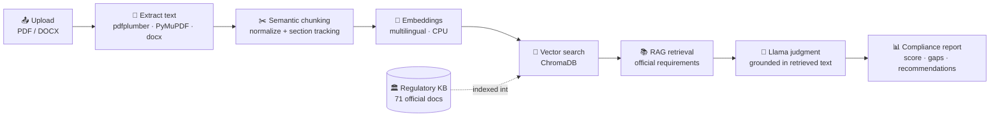

# واءم · WAAEM

### AI Governance & Compliance Platform

**Evaluate any organizational document against official Saudi regulations — using Retrieval‑Augmented Generation (RAG) and Llama.**

---

WAAEM (Arabic: **واءم**, *to align/harmonize*) is an AI‑powered platform that compares any uploaded governance document — a policy, procedure, manual, or internal regulation — against an **official Saudi regulatory knowledge base**, and returns a structured, Arabic‑first compliance report.

It does this with **Retrieval‑Augmented Generation (RAG)**: the platform maintains a live vector index of official regulations published by five Saudi authorities, retrieves the requirements most relevant to your document, and asks **Llama** to judge compliance grounded strictly in the retrieved regulatory text. There are **no hardcoded rules and no manual mappings** — and the model is never allowed to invent regulations that aren't in the knowledge base.

> **A real knowledge base, not a mock.** An ingestion pipeline downloads the actual official PDFs, extracts and chunks them, generates embeddings, and indexes them into a persistent vector database. Any source that cannot be fetched is **reported honestly with a reason** — never fabricated.

---

## 📑 Table of Contents

- [Features](#-features)
- [Supported Regulatory Authorities](#-supported-regulatory-authorities)
- [How It Works](#-how-it-works)
- [Knowledge Base](#-knowledge-base)
- [Compliance Report](#-compliance-report)
- [Screenshots](#-screenshots)
- [Acknowledgements](#-acknowledgements)

---

## ✨ Features

| | Capability | Details |
|---|---|---|
| 📤 | **Document upload** | Upload `PDF` and `DOCX` files (up to 25 MB by default). Analysis begins automatically on upload. |
| 📝 | **Automatic text extraction** | PDFs via **pdfplumber** with a **PyMuPDF** fallback; Word documents via **python‑docx** (including tables). |
| 🔎 | **OCR support** | Scanned regulatory PDFs with no text layer are OCR'd with **Tesseract** (`ara+eng`) during knowledge‑base ingestion. |
| 🤖 | **AI‑powered compliance analysis** | **Llama** judges each retrieved requirement as *Compliant / Partially Compliant / Non‑Compliant / Not Applicable*, with an Arabic justification. |
| 🧠 | **Retrieval‑Augmented Generation (RAG)** | Every judgment is grounded strictly in official regulatory text retrieved from the vector store — the model never invents regulations. |
| 📚 | **Vector search** | Multilingual (Arabic + English) semantic search over **ChromaDB** with cosine similarity and per‑authority coverage. |
| 🏛️ | **Official Saudi regulatory knowledge base** | 71 official source documents across 5 authorities, auto‑ingested from government portals with full provenance. |
| 📊 | **Compliance scoring** | An overall compliance percentage (0–100) plus a per‑authority breakdown and matched/partial/missing/critical totals. |
| 🧾 | **Executive summary** | An auto‑generated Arabic narrative summarizing the overall result and headline numbers. |
| 🕳️ | **Gap analysis** | Per requirement: what is missing, how it's covered, and the associated severity. |
| ✅ | **Recommendations** | Prioritized, deduplicated remediation actions tied to the specific official citation. |
| 📄 | **Evidence from the uploaded document** | Each finding quotes the passage in *your* document that supports (or fails to support) the requirement. |
| ⚖️ | **Evidence from official regulations** | Each finding is tied to the retrieved regulatory requirement, with reference id and source URL. |
| 🏷️ | **Authority‑based breakdown** | Compliance scored and grouped per regulatory authority. |
| 🖥️ | **Responsive enterprise dashboard** | A polished Arabic (RTL) Next.js workspace: animated score ring, KPI tiles, filterable findings, per‑authority drill‑down, and a detail drawer with the official citation. |

### Reliability built in

- **Graceful AI fallback** — if the primary model is unreachable or returns an error, WAAEM falls back to a deterministic, retrieval‑grounded scorer so the analysis never fails outright. It still cites only real retrieved regulations.
- **Honest ingestion** — the downloader respects `robots.txt`, validates that every download is a real PDF, and records failures (WAF/bot protection, HTTP status, broken link, not‑a‑PDF, needs‑OCR) instead of fabricating content.
- **Version history** — when a newer version of a regulation is detected (by file hash), the old version is superseded and re‑indexed while history is preserved.

---

## 🏛️ Supported Regulatory Authorities

WAAEM ships with a reference knowledge base covering **71 official documents** across **five Saudi regulatory authorities**:

| Authority | الجهة | Registered documents | Example scope |
|---|---|:--:|---|
| **DGA** — Digital Government Authority | هيئة الحكومة الرقمية | 18 | Digital Government Regulatory Framework, Digital Government Policies, IT Governance & Enterprise Architecture controls |
| **NCA** — National Cybersecurity Authority | الهيئة الوطنية للأمن السيبراني | 27 | Essential (ECC), Cloud (CCC), Critical Systems (CSCC), OT (OTCC), Data (DCC) & Telework (TCC) Cybersecurity Controls |
| **NDMO** — National Data Management Office | مكتب إدارة البيانات الوطنية | 12 | National Data Governance policies, data classification/sharing, open data, AI ethics principles |
| **PDPL** — Personal Data Protection Law | نظام حماية البيانات الشخصية | 6 | The Law, its Implementing Regulation, and the cross‑border data transfer regulation |
| **CST** — Communications, Space & Technology Commission | هيئة الاتصالات والفضاء والتقنية | 8 | Cybersecurity Regulatory Framework, cloud provisioning, personal‑data principles, IoT regulations |

> **Modular by design.** Adding a new authority or document requires **only** adding an entry to [`backend/app/kb/sources.py`](backend/app/kb/sources.py) — or pointing `KB_SOURCES_FILE` at an external JSON list — with **no application‑logic changes**. On the next ingestion run the new sources are downloaded, chunked, embedded, and indexed automatically.

---

## ⚙️ How It Works

The complete pipeline, from a raw upload to a finished report:

1. **Upload document** — the user uploads a `PDF` or `DOCX`; the backend validates the type and size.
2. **Text extraction** — text is extracted (pdfplumber → PyMuPDF fallback, or python‑docx).
3. **Document chunking** — the text is normalized and split into paragraph‑aware, section‑tracked semantic chunks with overlap.
4. **Embedding generation** — each chunk is embedded with a multilingual (Arabic + English) model.
5. **Retrieval from ChromaDB** — the chunk vectors query the vector store of official regulations.
6. **RAG retrieves the relevant regulatory requirements** — the best‑matching official controls are selected, with per‑authority coverage and full provenance.
7. **Llama evaluates compliance** — the model judges each retrieved requirement against the uploaded document and produces an Arabic verdict + evidence.
8. **Compliance report generation** — the backend aggregates scores per authority, computes totals, writes an executive summary, and returns a validated report to the dashboard.

> If Llama is unavailable or errors out, step 7 is replaced by a deterministic **retrieval‑grounded scorer** that assigns compliance status from semantic‑similarity thresholds — using the exact same retrieved requirements, so the report is always produced and always cited.

---

## 📚 Knowledge Base

The regulatory knowledge base is what makes WAAEM's analysis grounded rather than hallucinated. It is built by an ingestion pipeline that turns official government PDFs into a searchable, fully‑cited vector index.

**Ingestion pipeline** (`backend/app/kb/`):

1. **Official PDF ingestion** — for each entry in the source registry, the robots‑aware downloader fetches the official PDF, following redirects with realistic browser headers and validating that the response is a genuine PDF (not a WAF challenge page).
2. **Extraction (+ OCR)** — text is extracted from the PDF; if a document has no text layer, it is OCR'd with Tesseract (`ara+eng`). Documents that can't be extracted are recorded as `needs_ocr` rather than faked.
3. **Chunking** — text is normalized (diacritics/tatweel stripped, page noise removed) and split into paragraph‑aware semantic chunks with section tracking and overlap.
4. **Embeddings** — each chunk is embedded with a multilingual model that handles both Arabic and English.
5. **ChromaDB** — chunks are upserted into a persistent Chroma collection with full provenance metadata: authority, document title (AR/EN), version, publication date, section, paragraph, reference id, source URL, and language.
6. **Automatic retrieval** — at analysis time, the uploaded document's chunks query this store; the highest‑scoring official requirements (with per‑authority coverage) become the RAG context for the compliance judgment.

The KB **auto‑builds on first startup** when empty, and can **auto‑update** on a configurable interval — detecting new versions by file hash, superseding old ones, and preserving version history. Every run produces an honest report of successes, skips, and failures, surfaced via `GET /api/kb/status`.

---

## 📊 Compliance Report

Each analysis returns a structured, validated report. In the dashboard it renders as an animated score ring, KPI tiles, filterable findings, and a per‑authority breakdown.

| Section | What it contains |
|---|---|
| **Compliance Score** | An overall compliance percentage (0–100), computed as the mean of per‑authority scores. |
| **Executive Summary** | An auto‑generated Arabic narrative stating the overall score, the number of requirements evaluated, per‑authority scores, and matched/partial/missing/critical counts. |
| **Findings** | Per requirement: title, authority, source document, section, **status** (Compliant / Partially Compliant / Non‑Compliant / Not Applicable), rationale, severity, and semantic match score. |
| **Gap Analysis** | For each non‑compliant or partial requirement: what is missing or under‑specified, and the associated severity (NCA gaps are escalated to *critical*). |
| **Recommendations** | Prioritized, deduplicated remediation actions, each tied to the specific official citation to align with. |
| **Authority Breakdown** | Per‑authority score, matched count, and total — so you can see exactly where you stand with DGA, NCA, NDMO, PDPL, and CST. |
| **Source References** | Every finding carries evidence from *your* document, evidence from the regulation, a reference id, and a clickable official source URL. |

> When a requirement has no supporting evidence in the uploaded document, the finding says so explicitly (*"insufficient evidence"*) rather than guessing. Every statement traces back to a retrieved official chunk.

---

## 🖼️ Screenshots

> _Add screenshots / GIFs here._

| | |
|---|---|
| **Landing page** | _`docs/screenshots/landing.png`_ |
| **Upload** | _`docs/screenshots/upload.png`_ |
| **Analysis (in progress)** | _`docs/screenshots/analysis.png`_ |
| **Compliance report** | _`docs/screenshots/report.png`_ |
| **Dashboard** | _`docs/screenshots/dashboard.png`_ |

---

## 🙏 Acknowledgements

WAAEM is built on top of the **publicly available official regulations** published by Saudi regulatory authorities, used here strictly as reference material for compliance analysis. With gratitude to:

- **Digital Government Authority (DGA)** — هيئة الحكومة الرقمية
- **National Cybersecurity Authority (NCA)** — الهيئة الوطنية للأمن السيبراني
- **National Data Management Office (NDMO) / SDAIA** — مكتب إدارة البيانات الوطنية
- **Personal Data Protection Law (PDPL) / SDAIA** — نظام حماية البيانات الشخصية
- **Communications, Space & Technology Commission (CST)** — هيئة الاتصالات والفضاء والتقنية

All regulatory documents remain the property of their respective authorities. WAAEM does not redistribute or alter these documents; it retrieves and cites them to support compliance evaluation.

---

**واءم · WAAEM** — aligning organizations with Saudi regulations, intelligently.

